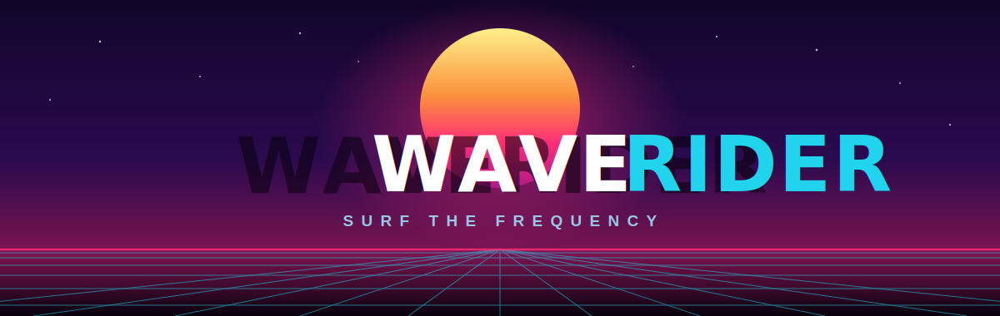

<p align="center">
  
</p>

<p align="center">
  <a href="LICENSE.md"></a>
  
  
  
  
</p>

**Drop any song. Ride the wave.**

WaveRider is a browser game that turns any song into a playable, beat-synced retrowave surf track — either
drop in your own audio file or browse free music straight from [Audius](https://audius.org/).
Built with Vue 3, Web Audio API, and three.js.

## Features

- 🎵 **Bring your own track or browse Audius** — drag & drop a local file, or search and stream from the built-in
  Audius music browser (trending by genre, with inline previews).
- 🌊 **Beat-synced generation** — per-band spectral-flux analysis turns the audio into a bumpy, curving retrowave road.
- 🎚️ **Quality presets + custom graphics** — Low / Medium / High, plus a Custom panel to dial in render scale, draw
  distance, scene density, bloom, and scanlines.
- 🧘 **Zen mode** — drop the collectibles and just ride.
- 🖥️ **Immersive mode** — a fullscreen toggle on desktop; phones auto-enter fullscreen and lock to landscape on start,
  with a "rotate your device" prompt in portrait.

## Quick Start

```bash
npm install
npm run dev     # dev server at http://localhost:5173
npm run build   # production build → dist/
npm run preview # preview the production build
```

## How to Play

1. Open the game in your browser.
2. Pick a track — **Browse Music** to search/stream free songs from Audius, or **Upload** to drag & drop (or click to
   browse) your own MP3, WAV, OGG, FLAC, or M4A file (max 20 MB).
3. WaveRider analyses the audio and generates a track from it.
4. Press **START** and surf!

### Controls

| Input            | Action              |
|------------------|---------------------|
| `←` / `A`        | Move left lane      |
| `→` / `D`        | Move right lane     |
| `P`              | Pause / Resume      |
| Touch left half  | Move left (mobile)  |
| Touch right half | Move right (mobile) |

> **Pausing:** use the `P` key or the on-screen pause button. `Esc` is intentionally left to the browser's
> exit-fullscreen behaviour and no longer opens the menu.
>
> **Fullscreen:** desktop has a fullscreen toggle in the top-right corner of the game; phones go fullscreen and lock to
> landscape automatically when you press **START**.

### Quality Settings

- **Low** — no bloom or scanlines, 0.65× render scale and reduced draw distance; best for weak devices.
- **Medium** — bloom + scanlines, 1× render scale.
- **High** — full post-processing, maximum scene density and draw distance.
- **Custom** — set your own based on your taste and device capability
## Project Structure

```
waverider/
├── public/
│   └── assets/
│       └── retrowave/       # 3D scene assets (skybox, SVGs)
│           ├── scenery/     # sun.svg, city_far.svg, city_close.svg
│           └── skybox/      # Cubemap textures (1024 / 2048 / 4096)
│
├── src/
│   ├── components/
│   │   ├── bass-surfer/
│   │   │   ├── AnalysisLoader.vue  # Loading screen shown during audio analysis
│   │   │   ├── GamePlay.vue        # Full game view (3D scene + HUD + menus + immersive mode)
│   │   │   ├── MusicBrowser.vue    # Audius search / trending browser with previews
│   │   │   ├── QualityMenu.vue     # Quality presets, Zen toggle, custom graphics modal
│   │   │   └── SongSelector.vue    # Drag-and-drop file picker
│   │   └── ui/
│   │       ├── DropdownSelect.vue  # Styled dropdown (genre / sort filters)
│   │       └── frosted-glass/      # Frosted glass panel component
│   │
│   ├── composables/
│   │   ├── useAudioAnalyzer.ts     # Web Audio spectral-flux analysis (per-band onsets)
│   │   └── useFullscreen.ts        # Fullscreen API wrapper (with WebKit fallback)
│   │
│   ├── lib/
│   │   └── bass-surfer/
│   │       ├── audius.ts           # Audius API client (trending, search, stream, download)
│   │       ├── sceneGenerator.ts   # three.js retrowave scene builder and renderer
│   │       ├── trackGenerator.ts   # Converts audio analysis → track segments
│   │       └── types.ts            # Shared TypeScript interfaces
│   │
│   ├── stores/
│   │   └── bassSurferStore.ts      # Pinia store (quality, custom settings, zen mode)
│   │
│   ├── css/
│   │   └── main.css                # Tailwind CSS entry
│   │
│   ├── App.vue                     # Root component — intro splash + screen routing (home → analyzing → game)
│   └── main.ts                     # App entry point
│
├── index.html
├── vite.config.ts
├── tsconfig.json
├── LICENSE.md
└── README.md
```

## Customisation

### Changing the scene path

Assets are served from `<base>/assets/retrowave/`, where `<base>` comes from Vite's `import.meta.env.BASE_URL`
(set the `base` option in `vite.config.ts` when hosting under a sub-path, e.g. GitHub Pages). The path is assembled in
`src/components/bass-surfer/GamePlay.vue`:

```ts
sceneManager = new RetrowaveScene(`${import.meta.env.BASE_URL}assets/retrowave/`, canvasRef.value, props.settings)
```

### Adjusting quality presets

Quality tiers are defined in `src/lib/bass-surfer/sceneGenerator.ts` under `RetrowaveScene.qualityPresets`. Change
whether bloom and scanlines are enabled, pixel ratio (resolution scale), scanline opacity, object counts, draw distance,
etc.

### Tuning audio analysis

All analysis thresholds live in `ANALYSIS_CONFIG` at the top of `src/composables/useAudioAnalyzer.ts` — band cut-off
frequencies, flux thresholds, the silence gate, and the normalization window.

### Tuning track generation

Track bump heights, cooldowns, and road curvature are in `GENERATOR_CONFIG` at the top of
`src/lib/bass-surfer/trackGenerator.ts`.

### Swapping skybox / scenery

Replace the PNG and SVG files inside `public/assets/retrowave/`. The skybox expects six faces:
`px.png`, `nx.png`, `py.png`, `nz.png`, and `invisible.png` (reused for both the bottom −Y face and the +Z face behind
the camera).
Three resolution sets are pre-built (`1024`, `2048`, `4096`); the scene always loads the `4096` set.

## Author

**Jakub Skurčák** — [jakub@skurcak.eu](mailto:jakub@skurcak.eu)

## Credits

- Retrowave 3D scene assets (skybox, SVG scenery) adapted from
  [retrowave-scene](https://github.com/moukrea/retrowave-scene) by Emeric Commenge — MIT License.
- Built
  with [three.js](https://threejs.org/), [Vue 3](https://vuejs.org/), [Pinia](https://pinia.vuejs.org/), [Vite](https://vitejs.dev/),
  and [Tailwind CSS](https://tailwindcss.com/).

## Contributing

Contributions are welcome! Please read [CONTRIBUTING.md](./CONTRIBUTING.md) for the
development setup, code-style conventions, and the local check suite
(`typecheck` / `lint` / `format` / `build`) to run before opening a pull request.

## License

See [LICENSE.md](./LICENSE.md) — MIT.
